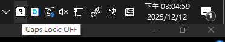
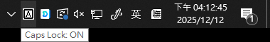
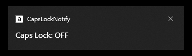
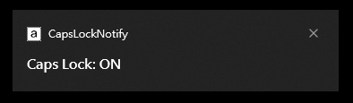

<!-- share_start -->

  

<h1 align="center">CapsLockNotify</h1>

# Github Status

<!-- 
 -->

<!-- 
 -->

<!-- share_end -->

# 說明

對 Caps Lock 狀態變更發出通知的輕量級 Windows 工具。

# 主要功能

1. 在 Windows 系統匣中新增一個圖示，反應 `Caps Lock` 和 `Shift` 鍵的目前狀態。

	

	

2. 當 Caps Lock 改變時右下跳出 Windows 桌面通知。
 
	

	

